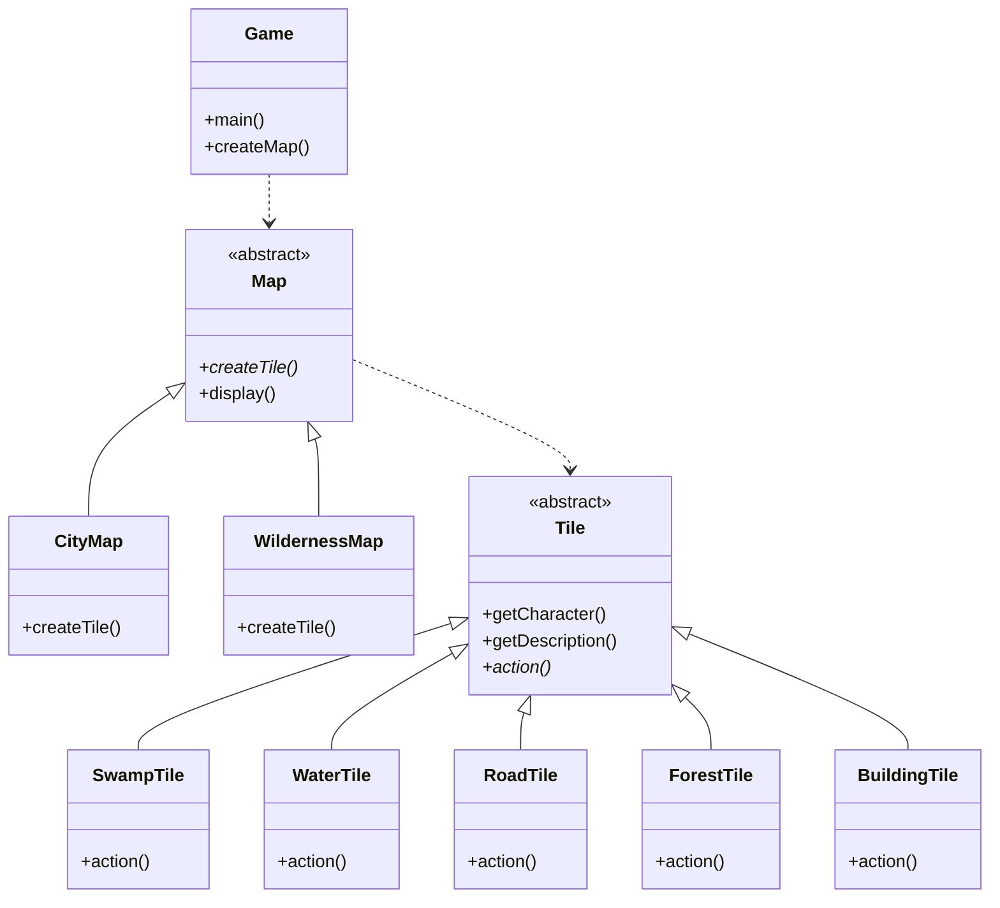

# Assignment: RPG Map Generator

> Note: the assignment was slightly modified on Thu January 25, 2024. In the class diagram of the original assignment, `Map` was drawn as an interface, but it should preferably be an abstract class. This allows for implementing the `display()` method only once, in the `Map` class. Furthermore, replacing the `Tile`interface with an abstract class brings similar benefits. If you have already implemented the assignment using interfaces, you can keep it that way and still get the points :-)

**Goal:**

The goal is to design an application that generates a random map for a role-playing game using the Factory Method design pattern.

**Guidelines:**

Imagine you are designing a role-playing game (RPG) world where players can navigate a rectangular terrain map. The map comprises various terrain tiles whose types are
- swamp,
- water,
- road,
- forest, and
- building.

Your program should define both the `Map` abstract class and the `Tile` interface.

A `Map` can be either a `CityMap` or a `WildernessMap`. A `CityMap`
contains randomly selected tiles of the following types: road, forest, and building. A `WildernessMap` contains randomly selected tiles of the following types: swamp, water, and forest.

A `Map` should have the following methods:
- abstract method `createTile()` that creates a new tile of random type (honoring the chosen map type) and returns it. This is the factory method, and the implementation should be in the subclass.
- `display()` that displays the map on the screen. Print the map as a matrix of characters (e.g. 'S' for swamp, 'W' for water, 'R' for road, 'F' for forest, 'B' for building). Note that the method should be completely agnostic of the concrete tile types.

The `Tile` abstract class should have the following methods:
- `getCharacter()` that returns the character that represents the tile type
- `getType` that returns the tile type as a string (e.g. "swamp", "water", "road", "forest", "building")

In addition, you should have a `Game` class that has a `main()` method. The `main()` method should create a desired `Map` object and display it on the screen. The `Game` class contains the factory method `createMap()` that creates either a `CityMap` or a `WildernessMap` object.

The `action` method in the concrete till classes is not used in this assignment. It is there to illustrate that the concrete tile classes can have additional methods that are not defined in the `Tile` interface.

The following class diagram illustrates the idea:

