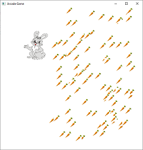

# Abstract Factory

> A creational pattern

## Example: [Game pic generator](../../src/main/java/abstract_factory/gamepic)

The example contains a JavaFX graphical user interface which displays a game pic of either a Pac-man style game or a Rabbit game.

|              Pacman              |              Rabbit              |
|:--------------------------------:|:--------------------------------:|
|  |  |

The GUI is implemented in the [`Gui`](../../src/main/java/abstract_factory/gamepic/view/Gui.java) class. In the class, a factory object (which implements the [GuiPartFactory](../../src/main/java/abstract_factory/gamepic/view/GuiPartFactory.java) interface) is created based on the chosen pic type. The implementing class is either a [`PacmanPicGuiFactory`](../../src/main/java/abstract_factory/gamepic/view/PacmanPicGuiFactory.java) or a [`RabbitPicGuiFactory`](../../src/main/java/abstract_factory/gamepic/view/RabbitPicGuiFactory.java). The factory object is then used to create the GUI components.

The factory classes are able to produce three types of GUI parts:
- the GraphicsContext object that is used to draw the GUI
- an object that implements the [`Character`](../../src/main/java/abstract_factory/gamepic/view/Character.java) interface
- an object that implements the [`Food`](../../src/main/java/abstract_factory/gamepic/view/Food.java) interface

These three components make a product family:

- A [`PacmanPicGuiPartFactory`](../../src/main/java/abstract_factory/gamepic/view/PacmanPicGuiPartFactory.java) produces a [`PacmanCharacter`](../../src/main/java/abstract_factory/gamepic/view/PacmanCharacter.java) and a [`PacmanFood`](../../src/main/java/abstract_factory/gamepic/view/PacmanFood.java) object as well as a GraphicsContext object that has a big black background.
- A [`RabbitPicGuiPartFactory`](../../src/main/java/abstract_factory/gamepic/view/RabbitPicGuiPartFactory.java) produces a [`RabbitCharacter`](../../src/main/java/abstract_factory/gamepic/view/RabbitCharacter.java) and a [`RabbitFood`](../../src/main/java/abstract_factory/gamepic/view/RabbitFood.java) object as well as a GraphicsContext object that has a smaller white background.

Note that in the classes that implement the [`Food`](../../src/main/java/abstract_factory/gamepic/view/Food.java) interface, the food can be drawn in very different ways:
- [`PacmanFood`](../../src/main/java/abstract_factory/gamepic/view/PacmanFood.java) is drawn as a yellow circle, and the food items are always arranged as a grid.
- [`RabbitFood`](../../src/main/java/abstract_factory/gamepic/view/RabbitFood.java) is drawn as a carrot, and the food items are displayed in random positions.

## See in the Internet

- Refactoring Guru: https://refactoring.guru/design-patterns/abstract-factory

- SourceMaking: https://sourcemaking.com/design_patterns/abstract_factory
