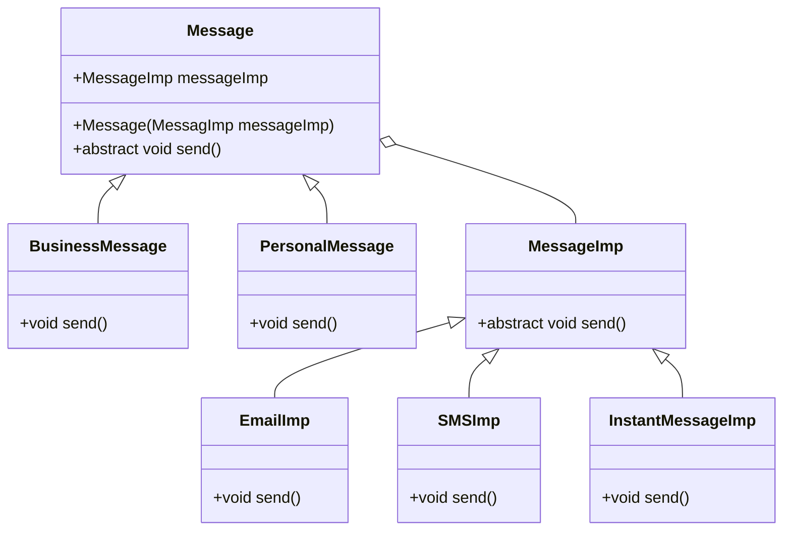

# Bridge

> An object structural pattern

## Example: [Messaging](../../src/main/java/bridge/messaging)

In this project, the Bridge design pattern is used to separate the abstraction of a messaging system from its implementation.

The abstraction is represented by the [`Message`](../../src/main/java/bridge/messaging/Message.java) interface (implemented as an abstract class), which defines the methods that a message can have. Specifically, there is the `send()` method, which is used to send the message.

The [`Message`](../../src/main/java/bridge/messaging/Message.java) interface has two implementations: [`BusinessMessage`](../../src/main/java/bridge/messaging/BusinessMessage.java) and [`PersonalMessage`](../../src/main/java/bridge/messaging/PersonalMessage.java). These implementations represent different types of messages that can be sent. Note that these are still abstractions and do not contain the actual implementation of the `send()` method.

The implementation is represented by the [`MessageImp`](../../src/main/java/bridge/messaging/MessageImp.java) interface. The interface declares the `sendMessage()` method, which is used to send the message. The interface has three implementations: [`EmailImpl`](../../src/main/java/bridge/messaging/EmailImp.java), [`SMSImp`](../../src/main/java/bridge/messaging/SMSImp.java), and [`InstantMessageImp`](../../src/main/java/bridge/messaging/InstantMessageImp.java). Each of these is able to send a message using a different medium.

The [`Message`](../../src/main/java/bridge/messaging/Message.java) interface has a reference to the [`MessageImp`](../../src/main/java/bridge/messaging/MessageImp.java) interface, which allows the [`Message`](../../src/main/java/bridge/messaging/Message.java) interface to delegate the implementation of its methods to the desired implementation interface.

This approach makes it possible to change the implementation of the message system without changing the abstraction. Also, developing the abstraction and implementation separately makes it easier to maintain and extend the system.

The [`Main`](../../src/main/java/bridge/messaging/Main.java) class demonstrates how the [`Message`](../../src/main/java/bridge/messaging/Message.java) interface can be used to send messages using different implementations but in an implementation-independent way.

The following class diagram illustrates the structure of the Bridge design pattern applied to the messaging system:

## See in the Internet

- Refactoring Guru: https://refactoring.guru/design-patterns/bridge

- SourceMaking: https://sourcemaking.com/design_patterns/bridge

