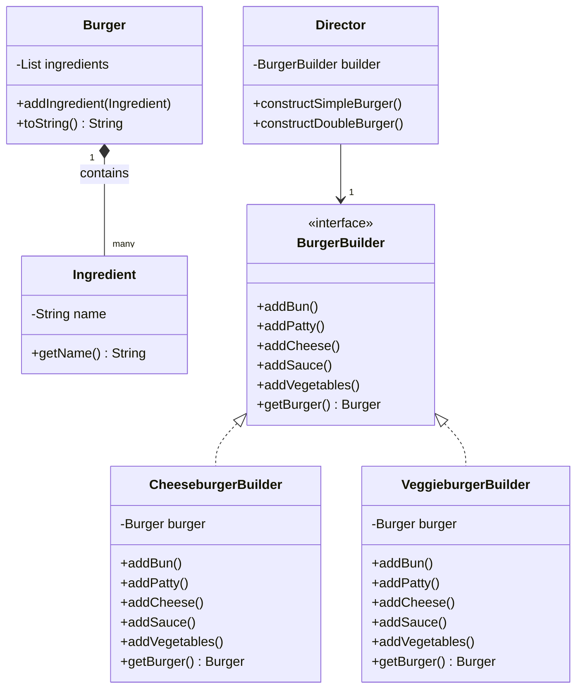

# Builder

> A creational pattern

## Example: [Burgers](../../src/main/java/builder/burgers)

The application demonstrates the Builder pattern by creating a burger. The methods for building a burger are declared in the [`BurgerBuilder`](../../src/main/java/builder/burgers/BurgerBuilder.java) interface. There are two concrete classes that implement the [`BurgerBuilder`](../../src/main/java/builder/burgers/BurgerBuilder.java) interface: [`VeggieburgerBuilder`](../../src/main/java/builder/burgers/VeggieburgerBuilder.java) and [`CheeseBurgerBuilder`](../../src/main/java/builder/burgers/CheeseburgerBuilder.java). Each class provides the necessary operations to build a burger of the corresponding type.

There is a [`Director`](../../src/main/java/builder/burgers/Director.java) class that is responsible for using the [`BurgerBuilder`](../../src/main/java/builder/burgers/BurgerBuilder.java) interface to build a burger. The [`Director`](../../src/main/java/builder/burgers/Director.java) class is not aware of the specific type of burger being built (veggie or cheeseburger), but it provides the methods to build a burger of any type, either in single or double format.

The [`BurgerBuilder`](../../src/main/java/builder/burgers/BurgerBuilder.java) interface also has a method to deliver the burger, which returns a [`Burger`](../../src/main/java/builder/burgers/Burger.java) object.

In the [`Main`](../../src/main/java/builder/burgers/Main.java) class, a [`Builder`](../../src/main/java/builder/burgers/Builder.java) and [`Director`](../../src/main/java/builder/burgers/Director.java) objects are created, and the [`Director`](../../src/main/java/builder/burgers/Director.java) is asked to create a burger using the chosen [`Builder`](../../src/main/java/builder/burgers/Builder.java).

The following class diagram illustrates the structure of the Builder pattern in the example:

> In this example, all resulting products share the same [`Burger`](../../src/main/java/builder/burgers/Burger.java) superclass, but the Builder pattern can be used to create products from completely different class hierarchies.

## See in the Internet

- Refactoring Guru: https://refactoring.guru/design-patterns/builder

- SourceMaking: https://sourcemaking.com/design_patterns/builder

