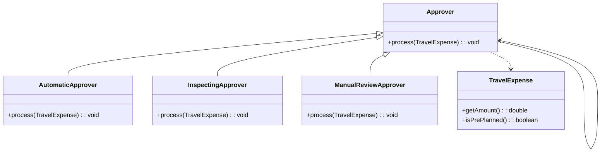

# Chain of Responsibility

> An object behavioral pattern

## Example: [Travel expense report approval](../../src/main/java/chain_of_responsibility/travel_expenses)

The application checks and approves an employee's travel expense report in accordance to the following company rules:

- The expenses are automatically approved if they are less than 100.
- Otherwise, the expenses undergo detailed automatic checking, after which they are approved if they are less than 400 and the trip is pre-planned.
- Otherwise, the expenses are sent for manual review.

The travel expenses are managed by the [`ExpenseReport`](../../src/main/java/chain_of_responsibility/travel_expenses/ExpenseReport.java) class, which has the `getAmount()` and `isPlanned()` methods.

The abstract superclass [`Approver`](../../src/main/java/chain_of_responsibility/travel_expenses/Approver.java) declares the `process()` method, and is responsible for managing the next object in the chain.

The concrete subclasses [`AutomaticApprover`](../../src/main/java/chain_of_responsibility/travel_expenses/AutomaticApprover.java),
[`InspectingApprover`](
../../src/main/java/chain_of_responsibility/travel_expenses/InspectingApprover.java), and
[`ManualReviewApprover`](../../src/main/java/chain_of_responsibility/travel_expenses/ManualReviewApprover.java) implement the `process()` method with ample checks, and decide whether to pass the request to the next object in the chain.
)

Finally, the [`Main`](../../src/main/java/chain_of_responsibility/travel_expenses/Main.java) class demonstrates the use of the pattern.
Note that in this example, such a variant of the Chain of Responsibility pattern is used, where the request is passed to the next object in the chain only if the current object cannot process it.

The following class diagram depicts the structure of the example:

## See in the Internet

- Refactoring Guru: https://refactoring.guru/design-patterns/chain-of-responsibility

- SourceMaking: https://sourcemaking.com/design_patterns/chain_of_responsibility

