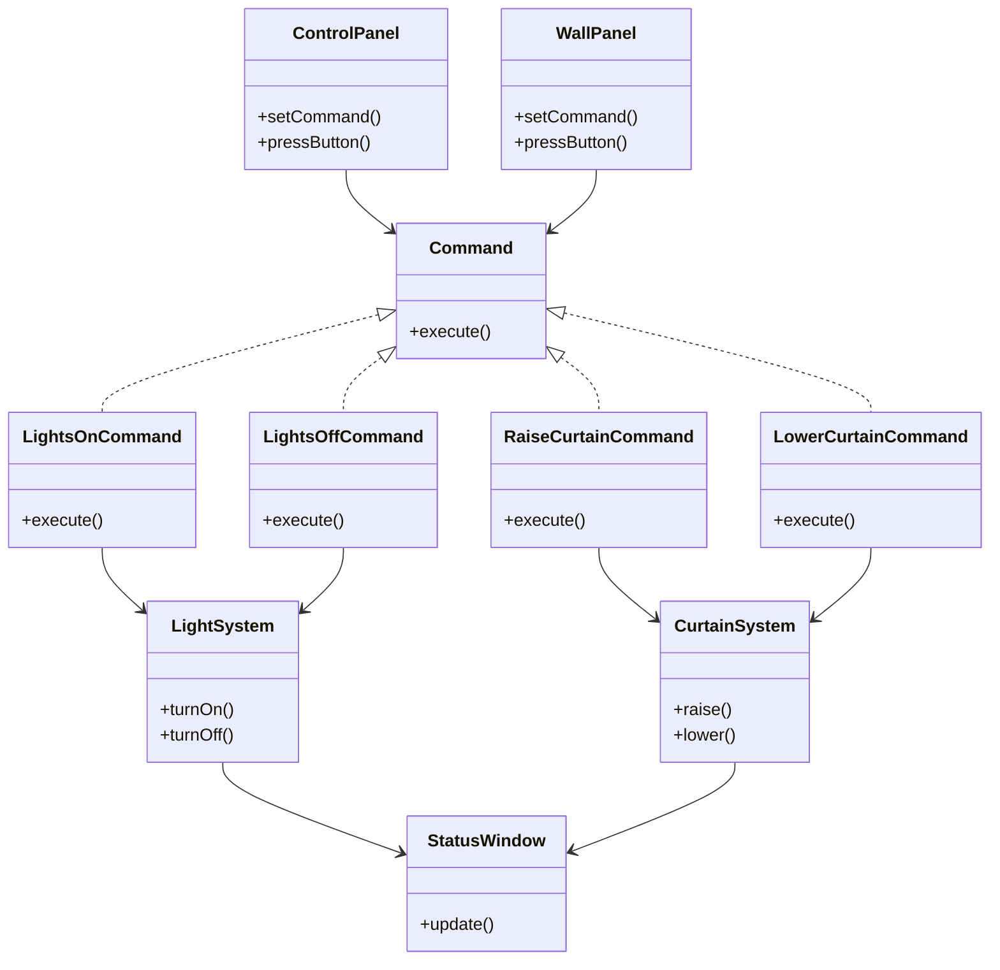

# Command

> A behavioral design pattern

## Example: [Theater Control System](../../src/main/java/command/theater)

In this project, the Command design pattern is employed to manage a theater's lighting and curtain systems through a JavaFX application. This implementation allows for the separation of concerns between the user interface and the action execution, enhancing the flexibility and extensibility of the code.

### Structure

The project is divided into several packages, each containing specific components of the Command pattern:

- **Command Interface and Concrete Commands**:
    - [`Command`](../../src/main/java/command/theater/Command.java): An interface for executing actions.
    - [`LightsOnCommand`](../../src/main/java/command/theater/LightsOnCommand.java): Turns on the lights.
    - [`LightsOffCommand`](../../src/main/java/command/theater/LightsOffCommand.java): Turns off the lights.
    - [`RaiseCurtainCommand`](../../src/main/java/command/theater/RaiseCurtainCommand.java): Raises the curtain.
    - [`LowerCurtainCommand`](../../src/main/java/command/theater/LowerCurtainCommand.java): Lowers the curtain.

- **Receivers**:
    - [`LightSystem`](../../src/main/java/command/theater/LightSystem.java): Manages the theater's lighting.
    - [`CurtainSystem`](../../src/main/java/command/theater/CurtainSystem.java): Controls the movement of the curtains.

- **Invoker**:
    - [`ControlPanel`](../../src/main/java/command/theater/ControlPanel.java): A GUI panel that sends commands to the light and curtain systems.
    - [`WallPanel`](../../src/main/java/command/theater/WallPanel.java): A simple interface with two buttons to control the lighting.

- **Client**:
    - [`Main`](../../src/main/java/command/theater/Main.java): Initializes the application.
    - [`GUI`](../../src/main/java/command/theater/GUI.java): Sets up the relationships between commands, invokers, and receivers. Defines the JavaFX graphical user interface for interacting with the theater systems.
    - [`StatusWindow`](../../src/main/java/command/theater/StatusWindow.java): Displays the current status of the lights and curtains, providing visual feedback through colored rectangles and labels.

### Operation

The application allows the user to control the theater's lights and curtains using either the `ControlPanel` or the `WallPanel`. Commands are encapsulated in specific command objects and executed by invoking methods on the receivers through the invokers. The `StatusWindow` reflects the changes in real time.

### Structure

The following class diagram illustrates the relationships between the components of the Command pattern in the Theater Control System:

The use of the Command pattern allows further commands to be added without modifying existing code, adhering to the open/closed principle.

## See in the Internet

- Refactoring Guru: [https://refactoring.guru/design-patterns/command](https://refactoring.guru/design-patterns/command)
- SourceMaking: [https://sourcemaking.com/design_patterns/command](https://sourcemaking.com/design_patterns/command)

