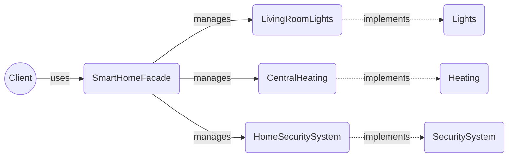

# Facade

> A structural design pattern

## Example: [Smart Home System](../../src/main/java/facade/smart_home)

In this project, the Facade design pattern is employed to simplify interactions with a complex smart home system consisting of lighting, heating, and security subsystems.

### Interfaces and Classes

- The [`Lights`](../../src/main/java/facade/smart_home/Lights.java) interface defines basic operations such as `turnOn` and `turnOff` for managing lights.

- The [`LivingRoomLights`](../../src/main/java/facade/smart_home/LivingRoomLights.java) class implements the `Lights` interface, specifically handling the lighting operations in the living room.

- The [`Heating`](../../src/main/java/facade/smart_home/Heating.java) interface provides methods `heatOn` and `heatOff` to control heating systems.

- The [`CentralHeating`](../../src/main/java/facade/smart_home/CentralHeating.java) class implements the `Heating` interface, managing the central heating operations.

- The [`SecuritySystem`](../../src/main/java/facade/smart_home/SecuritySystem.java) interface includes security-related operations like `activate`, `deactivate`, and additional functionality to `readLog`, which allows direct access to the security logs.

- The [`HomeSecuritySystem`](../../src/main/java/facade/smart_home/HomeSecuritySystem.java) class implements these methods and provides detailed control over the home security system.

- The [`SmartHomeFacade`](../../src/main/java/facade/smart_home/SmartHomeFacade.java) class combines these subsystems and provides a simple interface to handle common tasks such as arriving home or leaving home, effectively reducing the complexity of the operations required from the client side.

### Main Application

- The [`SmartHomeApp`](../../src/main/java/facade/smart_home/SmartHomeApp.java) class demonstrates the use of the `SmartHomeFacade` to manage the various subsystems in an integrated manner. It shows how the facade simplifies the usage of the subsystems by hiding the complexities and allowing the client to perform common tasks with simple method calls.

>Note that even though the [`SmartHomeApp`](../../src/main/java/facade/smart_home/SmartHomeApp.java) utilizes the facade to interact with the subsystems, it can still access the subsystems directly if needed. This flexibility allows the client to access the subsystems directly for more advanced operations while still benefiting from the simplified facade for common tasks. In the example, the [`SmartHomeApp`](../../src/main/java/facade/smart_home/SmartHomeApp.java) directly accesses the [`HomeSecuritySystem`](../../src/main/java/facade/smart_home/HomeSecuritySystem) to read the security logs.

## See in the Internet

- Refactoring Guru: https://refactoring.guru/design-patterns/facade

- SourceMaking: https://sourcemaking.com/design_patterns/facade