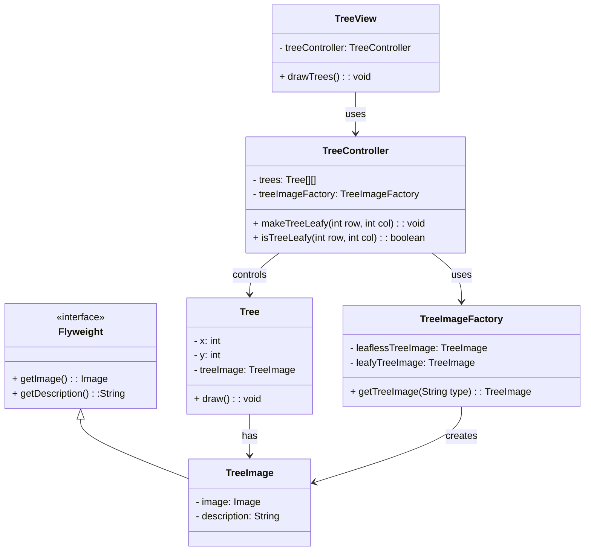

# Flyweight

> A structural pattern

## Example: [Birch trees](../../src/main/java/flyweight/birch_trees)

The application builds a rectangular forest of planted birch trees that are all leafless, as it is winter. As the application runs, the leafless trees turn green, one by one.

The application uses the Flyweight pattern to make sure that the tree images are shared between the trees. For tree images, there is a factory class [`TreeImageFactory`](../../src/main/java/flyweight/birch_trees/TreeImageFactory.java) that creates and manages the tree images. The class has references to two images: one for leafless trees and one for green trees. The factory class has a method `getTreeImage()` that returns the tree image for a tree.

> If there were many different images, the factory class would create them whenever necessary, making sure that the same image is not created twice. As there are just two images, the factory class creates them at the beginning and returns the same image whenever it is requested.

In our updated example, the roles of the Flyweight design pattern are mapped as follows:

1. **Flyweight (Interface):** The [`Flyweight`](../../src/main/java/flyweight/birch_trees/Flyweight.java) interface defines the common interface for all flyweight objects. It allows the sharing of these objects by defining the essential methods that concrete flyweights must implement.

2. **Concrete Flyweight ([`TreeImage`](../../src/main/java/flyweight/birch_trees/TreeImage.java)):** The [`TreeImage`](../../src/main/java/flyweight/birch_trees/TreeImage.java) class implements the `Flyweight` interface, making it a concrete flyweight. It provides the specific implementation for the flyweight interface, holding the intrinsic state (the image and its description) that can be shared across multiple [`Tree`](../../src/main/java/flyweight/birch_trees/Tree.java) objects.

3. **Flyweight Factory ([`TreeImageFactory`](../../src/main/java/flyweight/birch_trees/TreeImageFactory.java)):** The [`TreeImageFactory`](../../src/main/java/flyweight/birch_trees/TreeImageFactory.java) class acts as the Flyweight Factory. It is responsible for creating and managing [`TreeImage`](../../src/main/java/flyweight/birch_trees/TreeImage.java) instances (leafy and leafless tree images). This factory ensures that for each unique image, only one [`TreeImage`](../../src/main/java/flyweight/birch_trees/TreeImage.java) instance is created and shared among multiple [`Tree`](../../src/main/java/flyweight/birch_trees/Tree.java) objects, thereby minimizing memory usage.

4. **Client ([`TreeController`](../../src/main/java/flyweight/birch_trees/TreeController.java):** In this context,  [`TreeController`](../../src/main/java/flyweight/birch_trees/TreeController.java)  acts as the client. [`TreeController`](../../src/main/java/flyweight/birch_trees/TreeController.java) manages the state of [`Tree`](../../src/main/java/flyweight/birch_trees/Tree.java) objects and communicates with the [`TreeImageFactory`](../../src/main/java/flyweight/birch_trees/TreeImageFactory.java) to obtain `TreeImage` objects. 

5. **Unshared Concrete Flyweight:** In the Flyweight pattern, the Unshared Concrete Flyweight role represents flyweight objects that are not shared. In our current example, this role is not explicitly implemented because all [`TreeImage`](../../src/main/java/flyweight/birch_trees/TreeImage.java) instances are designed to be shared among multiple [`Tree`](../../src/main/java/flyweight/birch_trees/Tree.java) objects to demonstrate the memory efficiency of the Flyweight pattern. However, if there were a need to have unique tree images that should not be shared (e.g., a special tree with a unique visual effect), we could introduce `UnsharedConcreteFlyweight` objects to handle such cases, ensuring that the design remains flexible and extendable for future requirements.

The [`Tree`](../../src/main/java/flyweight/birch_trees/Tree.java) class, while not explicitly part of the Flyweight pattern in Gamma's definition, acts as the context in which the flyweight ([`TreeImage`](../../src/main/java/flyweight/birch_trees/TreeImage.java)) is used. Each [`Tree`](../../src/main/java/flyweight/birch_trees/Tree.java) object holds a reference to a [`TreeImage`](../../src/main/java/flyweight/birch_trees/TreeImage.java) object (the shared flyweight) and maintains its extrinsic state.

[`TreeView`](../../src/main/java/flyweight/birch_trees/TreeView.java) is responsible for rendering the trees on the screen, using the `TreeImage` instances to draw the appropriate images for each tree.

Finally, the [`Main`](../../src/main/java/flyweight/birch_trees/Main.java) class initializes the application, creating the forest of trees and updating their state over time.

The following class diagram shows the structure of the Flyweight pattern in the context of the Birch Trees example:

## See in the Internet

- Refactoring Guru: https://refactoring.guru/design-patterns/flyweight

- SourceMaking: https://sourcemaking.com/design_patterns/flyweight