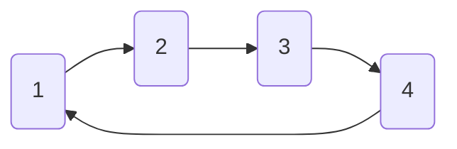
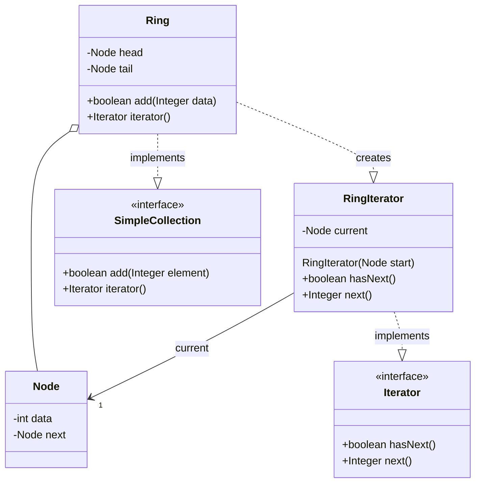

# Iterator

> A behavioral design pattern

## Example: [Ring Structure](../../src/main/java/iterator/ring)

In this project, the Iterator design pattern is used to facilitate traversal through a circular data structure called ring.

The [`SimpleCollection`](../../src/main/java/iterator/ring/SimpleCollection.java) interface defines a simple collection of integers that supports adding elements and creating an iterator. The interface declares two methods: `add` to insert an element into the collection, and `iterator` to create an iterator for traversing the collection.

The concrete data structure is represented by the [`Ring`](../../src/main/java/iterator/ring/Ring.java) class, which manages a circular list of integers. The [`Ring`](../../src/main/java/iterator/ring/Ring.java) class supports operations such as adding elements to the list, and it ensures that the last element is linked back to the first, creating a circular loop. The following image shows a ring structure with four integers, 1, 2, 3, and 4:

The [`Node`](../../src/main/java/iterator/ring/Node.java) class is used within the [`Ring`](../../src/main/java/iterator/ring/Ring.java) class to hold individual elements of the list. Each [`Node`](../../src/main/java/iterator/ring/Node.java) contains an integer datum and a reference to the next node, forming the link in the circular list.

To traverse the ring, the [`RingIterator`](../../src/main/java/iterator/ring/RingIterator.java) class is used, which implements the `Iterator<Integer>` interface as defined in the `java.util` package. This iterator provides a way to access elements in the ring repeatedly in a circular manner, without modifying the underlying data structure.

The [`Main`](../../src/main/java/iterator/ring/Main.java) class demonstrates how to use the [`Ring`](../../src/main/java/iterator/ring/Ring.java) and its iterator. It adds several elements to the [`Ring`](../../src/main/java/iterator/ring/Ring.java) and then uses the [`RingIterator`](../../src/main/java/iterator/ring/RingIterator.java) to print elements in a loop, showcasing the circular iteration.

> As the iterator circulates through the ring eternally, the client code must decide when to stop the iteration with a break statement or a counter.

> The [`SimpleCollection`](../../src/main/java/iterator/ring/SimpleCollection.java) interface, and the [`Ring`](../../src/main/java/iterator/ring/Ring.java) class, could be further extended to support additional operations, such as removing elements, searching for elements, or getting the size of the collection. Furthermore, it could be generalized to work with any type of elements, not just integers.

The following class diagram illustrates the structure of the Iterator design pattern applied to the ring structure:

## See in the Internet

- Refactoring Guru: https://refactoring.guru/design-patterns/iterator

- SourceMaking: https://sourcemaking.com/design_patterns/iterator
