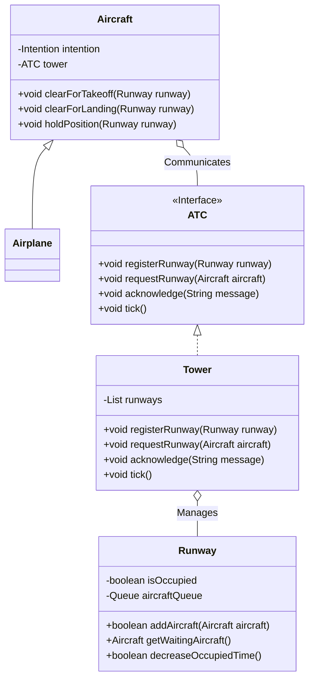

# Mediator

> A behavioral design pattern

## Example: [Air Traffic Control](../../src/main/java/mediator/atc)

The application simulates the operations of an airport where aircraft can either take off or land. The mediator (the control tower) manages communication between aircraft and the runway, ensuring that each aircraft is assigned to a runway or asked to hold if necessary. The use of the Mediator pattern helps to decouple the aircraft and the runway, and eliminates the need of the aircraft to communicate directly with each other about their runway requests.

The simulation runs according to the following rules:
- There are two runways.
- In each time unit, the number of new planes for takeoff follows geometric distribution (p=0.2)
- Likewise, the number of new planes for landing in a time unit follows geometric distribution (p=0.2)
- Each plane taking off or landing occupies a runway for 5 time units
- A plane is allocated an empty runway if one exist
- If no empty runway is available, the plane queues for the runway that has the shortest queue

In this example, the [`Aircraft`](../../src/main/java/mediator/atc/Aircraft.java) class is an abstract class that defines the basic characteristics and behaviors of an aircraft. Concrete aircraft types, like [`Airplane`](../../src/main/java/mediator/atc/Airplane.java), extend this class. Each [`Aircraft`](../../src/main/java/mediator/atc/Aircraft.java) instance has an [`Intention`](../../src/main/java/mediator/atc/Intention.java) (TAKEOFF or LANDING) and communicates its runway request to the control tower upon creation.

The [`ATC`](../../src/main/java/mediator/atc/ATC.java) (Air Traffic Control) interface defines the methods that the control tower must implement to interact with the aircraft and manage the runways. The [`Tower`](../../src/main/java/mediator/atc/Tower.java) class is the concrete implementation of [`ATC`](../../src/main/java/mediator/atc/ATC.java) and acts as the Mediator. It maintains a list of runways and handles the assignment of runways to aircraft, responding to their takeoff or landing requests.

The [`Runway`](../../src/main/java/mediator/atc/Runway.java) class represents a runway at the airport. It keeps track of its status (occupied or not) and manages a queue of aircraft waiting to use the runway.

The [`Simulator`](../../src/main/java/mediator/atc/Simulator.java) runs the simulation for a fixed number of time steps. During each time step, the control tower checks the status of the runways, and assigns runways to aircraft if they are available.

The [`Main`](../../src/main/java/mediator/atc/Main.java) class acts as a starting point for the application. It creates a control tower as well as a couple of runways under its control, and asks the simulator to run the simulation.

Here's how the communication flow is orchestrated by the Mediator:
- Aircraft send a runway request to the Tower (Mediator) when they are created.
- The Tower assigns a free runway or queues the aircraft if all runways are busy.
- The Tower informs the aircraft whether it can take off, land, or needs to hold.

The following class diagram illustrates the relationships between the classes in this example:

## See on the Internet

- Refactoring Guru: https://refactoring.guru/design-patterns/mediator

- SourceMaking: https://sourcemaking.com/design_patterns/mediator

