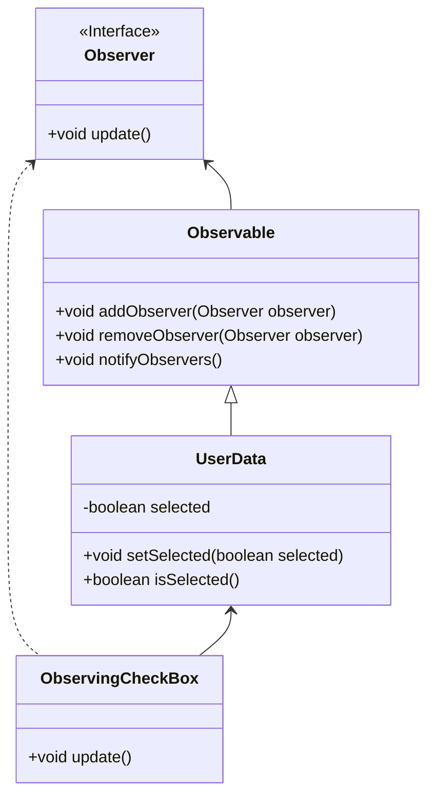

# Observer

> A behavioral pattern

## Example: [Updating checkboxes](../../src/main/java/observer/checkboxes)

The application opens three windows, each with a checkbox. Once the user click one of the checkboxes, the subject's (that is, the [`UserData`](
../../src/main/java/observer/checkboxes/model/UserData.java) object's) status is updated, and all checkboxes are informed about the change. As a consequence, all other checkboxes query the status of the subject and update themselves accordingly.

In this example, there is a simple [`Observer`](../../src/main/java/observer/checkboxes/view/Observer.java) interface with a single method `update()`. The [`ObservingCheckBox`](../../src/main/java/observer/checkboxes/view/ObservingCheckBox.java) is a subclass of the JavaFX library Checkbox class that, in addition, implements the `Observer` interface. Thus, the `ObservingCheckBox` class has a method `update()` that is called by the subject when the subject changes. Once called, the `update()` method immediately queries the subject for the new state and updates the checkbox accordingly.

The [`UserData`](../../src/main/java/observer/checkboxes/model/UserData.java) is a subclass of the abstract [´Observable`](../../src/main/java/observer/checkboxes/model/Observable.java) class that stores the list of observers as well as provides methods for adding and removing observers.

The `UserData` class, which is a subclass of `Observable`, has methods `setSelected()` and `isSelected()` that superficially look as regular setter and getter methods. However, the `setSelected()` method also calls the `notifyObservers()` method of the superclass. The `notifyObservers()` method calls the `update()` method of each observer in the list of observers.

The following class diagram shows the classes and their relationships:

## See in the Internet

- Refactoring Guru: https://refactoring.guru/design-patterns/observer

- SourceMaking: https://sourcemaking.com/design_patterns/observer

