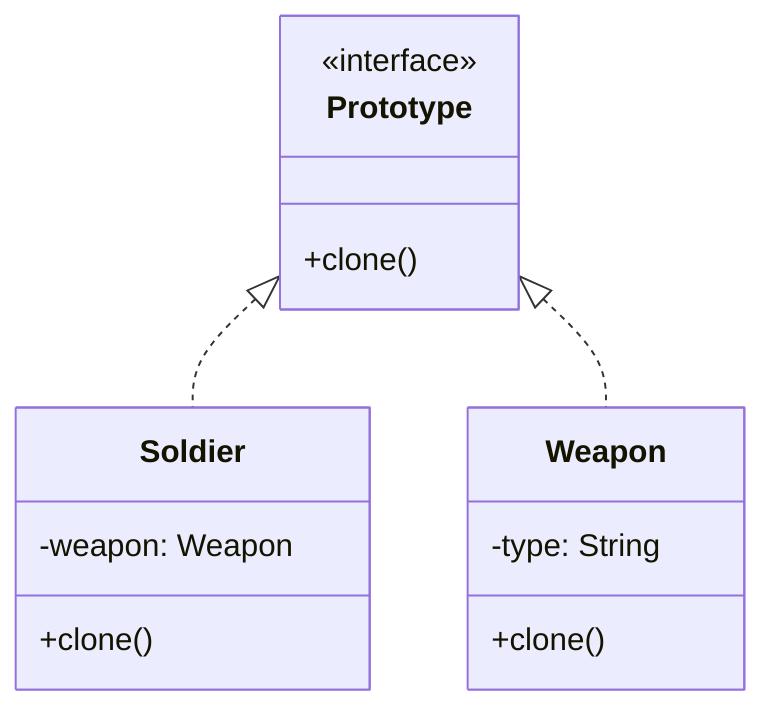
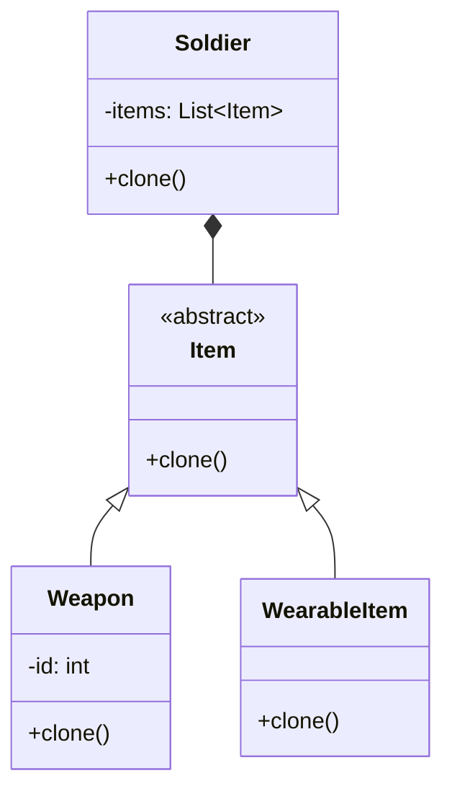

# Prototype

> An object creational pattern

## Example: [War Game](../../src/main/java/prototype/wargame)

In a war game, soldiers are equipped with weapons, and other items. Instead of creating each soldier and weapon from scratch, we can clone existing soldiers and weapons to save time and resources. This is where the Prototype pattern comes into play.

For this design pattern, there are two examples:
- a [simple example](../../src/main/java/prototype/wargame/simple) that directly clones objects without using Java's built-in cloning mechanisms. It uses shallow copying to clone objects.
- an [advanced example](../../src/main/java/prototype/wargame/advanced) that demonstrates deep copying in creating clones, and utilizes Java's built-in `Object.clone()` method.

### Simple Example: [Shallow copying](../../src/main/java/prototype/wargame/simple)

In the simple example, we demonstrate basic object cloning without using Java's built-in cloning mechanisms. Instead, we define a custom [`Prototype`](../../src/main/java/prototype/wargame/simple/Prototype.java) interface to manage cloning.

#### Structure

- **[`Prototype`](../../src/main/java/prototype/wargame/simple/Prototype.java) Interface**: A custom interface that includes a `clone` method.
- **[`Soldier`](../../src/main/java/prototype/wargame/simple/Soldier.java) Class**: Implements the Prototype interface and represents a soldier with a weapon.
- **[`Weapon`](../../src/main/java/prototype/wargame/simple/Weapon.java) Class**: Also implements the Prototype interface, representing a weapon with a type.
- **[`Main`](../../src/main/java/prototype/wargame/simple/Main.java) Class**: Demonstrates the creation and cloning of [`Soldier`](../../src/main/java/prototype/wargame/simple/Soldier.java) objects.

In this example, as a soldier is cloned, just the reference to the weapon is copied, not the weapon itself. This is known as shallow copying. This approach will do, as the weapons are generic and do not change.

#### Class Diagram

### Advanced Example: [Enhanced Cloning](../../src/main/java/prototype/wargame/advanced)

The advanced example extends the simple one by introducing more complexity. It utilizes Java's `Object.clone()` implementation for deep cloning and does not use a separate Prototype interface for this reason.

To highlight the fact that the Prototype pattern shines with complex objects, this  example demonstrates complex soldiers that are built using the [Builder](builder.md) pattern. For building the soldiers, the classes [`SoldierBuilder`](../../src/main/java/prototype/wargame/advanced/SoldierBuilder.java) and [`Director`](../../src/main/java/prototype/wargame/advanced/Director.java) are used.

These classes are not part of the Prototype pattern, and they will not be further discussed in this example.

#### Structure

- **[`Soldier`](../../src/main/java/prototype/wargame/advanced/Soldier.java) Class**: Represents a soldier with a list of items and implements deep cloning using Java's `clone()` method.
- **[`Item`](../../src/main/java/prototype/wargame/advanced/Item.java) Class**: An abstract class that serves as the base for different item types.
- **[`Weapon`](../../src/main/java/prototype/wargame/advanced/Weapon.java) Class**: Inherits from Item and includes unique identification, utilizing `Object.clone()`.
- **[`WearableItem`](../../src/main/java/prototype/wargame/advanced/WearableItem.java) Class**: Another subclass of Item, representing wearable gear.
- **[`Main`](../../src/main/java/prototype/wargame/advanced/Main.java) Class**: Demonstrates the creation and cloning of [`Soldier`](../../src/main/java/prototype/wargame/advanced/Soldier.java) objects with various items.

In this example, the `Soldier` class has a list of items, which can be weapons or wearable items. When a soldier is cloned, a deep copy is made, including the items. This way, the cloned soldier has its own set of items, not just references to the original soldier's items.

The cloning is done with Java's `Object.clone()` method, which creates a new instance of the object and copies the values of all fields. As such, the `Object.clone()` method creates a shallow copy of an object. The overridden `clone()` method in the [`Soldier`](../../src/main/java/prototype/wargame/advanced/Soldier.java)
class ensures that a deep copy is made by separately cloning each item in the list.

#### Class Diagram

## See in the Internet

- Refactoring Guru: [Prototype Pattern](https://refactoring.guru/design-patterns/prototype)
- SourceMaking: [Prototype Pattern](https://sourcemaking.com/design_patterns/prototype)
