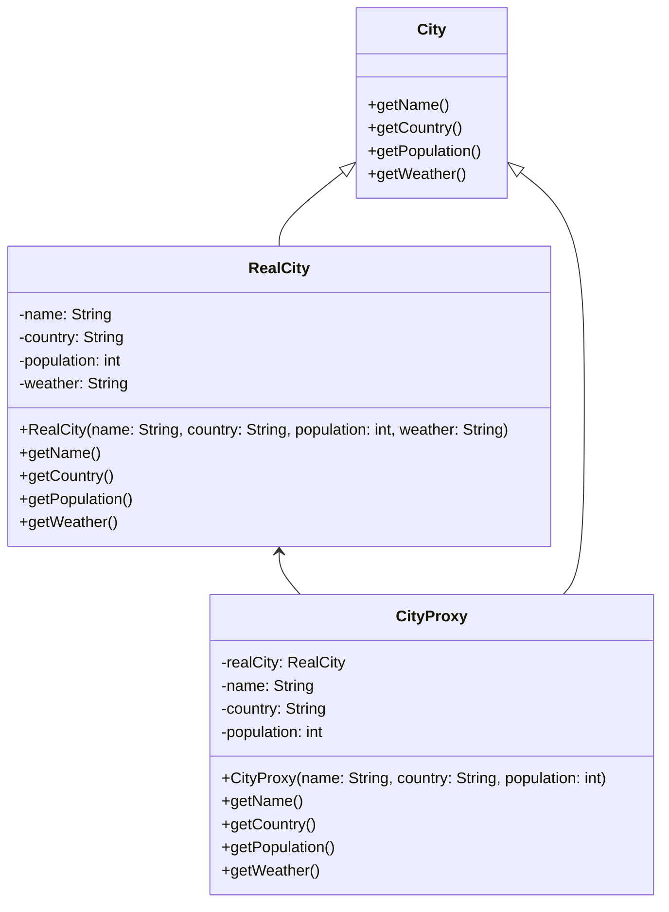

# Proxy

> An object structural pattern

## Example: [Cities](../../src/main/java/proxy/cities)

The motivation for this example is to avoid unnecessary API calls that may take time and cost money. The example is about cities and their weather information. The weather information is retrieved from the [OpenWeather API](https://openweathermap.org/api).

The proxy is a virtual proxy that retrieves the weather information only when it is needed. (Alternatively, the proxy can be categorized as a remote proxy, as it retrieves the weather information from a remote server.)

In this example, the client, the [`Main`](../../src/main/java/proxy/cities/Main.java) class, creates cities, after which it retrieves their names, populations, and weather information. In this example, the client uses the [`City`](../../src/main/java/proxy/cities/City.java) interface to interact with the cities. The interface has just four getter methods: `getName()`, `getCountry()`, `getPopulation()`, and `getWeather()`.

The [`City`](../../src/main/java/proxy/cities/City.java) interface is implemented by the [`RealCity`](../../src/main/java/proxy/cities/RealCity.java) class, which is the real subject. The [`RealCity`](../../src/main/java/proxy/cities/RealCity.java) class has a constructor that takes the city's name, country, population, and weather.

The [`CityProxy`](../../src/main/java/proxy/cities/CityProxy.java) class is the proxy. The proxy has a reference to the real subject, which is a [`RealCity`](../../src/main/java/proxy/cities/RealCity.java) object. The proxy has a constructor that takes just three parameters: the city's name, country, and population. One of the getters, `getWeather()`, is heavily modified: the method checks if the real subject has been created. In case the real subject has not been created, the proxy creates the real subject and then retrieves the weather information via OpenWeather API. On the other hand, if the real subject has been created, the proxy simply retrieves the weather information from the real subject.

In this example, the client creates either a [`CityProxy`](../../src/main/java/proxy/cities/CityProxy.java) object or a [`RealCity`](../../src/main/java/proxy/cities/RealCity.java) object. This could be replaced by a factory method that creates the proxy or the real subject based on some criteria, making the client unaware of the very existence of the proxy.

The class diagram for this example is shown below:

## See in the Internet

- Refactoring Guru: https://refactoring.guru/design-patterns/proxy

- SourceMaking: https://sourcemaking.com/design_patterns/proxy

