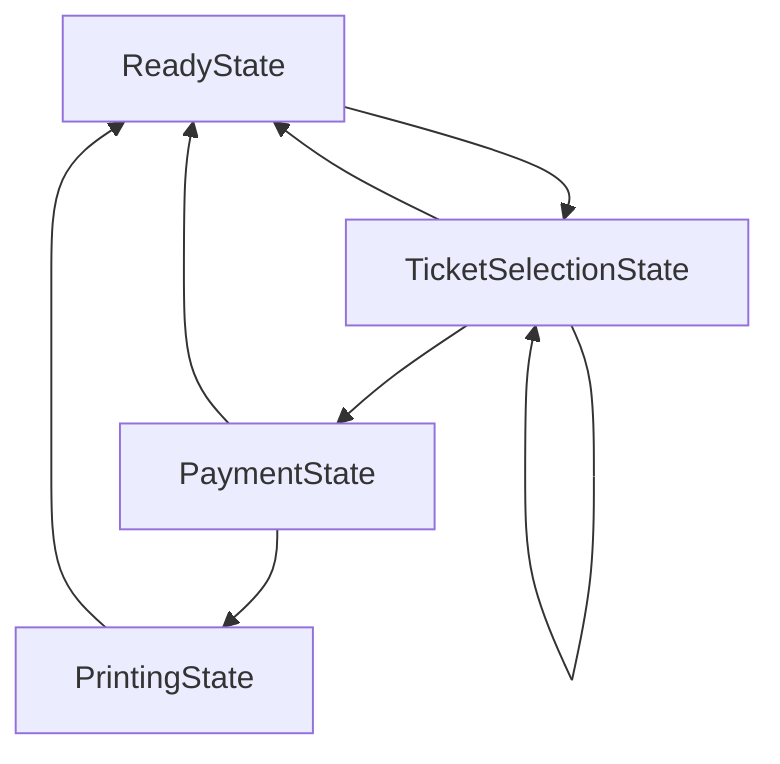

# State

> A behavioral pattern

## Example: [Ticket vending machine](../../src/main/java/state/ticket_vending_machine)

The [`Machine`](../../src/main/java/state/ticket_vending_machine/Machine.java) class represents a ticket vending machine. It has a state, which is represented by the [`State`](../../src/main/java/state/ticket_vending_machine/State.java) abstract class. The class declares an `action()` method for the actions that are performed by the machine in the corresponding state.

The subclasses of the `State` class represent the states of the machine.
- The [`ReadyState`](../../src/main/java/state/ticket_vending_machine/ReadyState.java) class represents the state when the machine is ready to sell tickets.
- The [`TicketSelectionState`](../../src/main/java/state/ticket_vending_machine/TicketSelectionState.java) class represents the state when the machine is waiting for the user to select one or more tickets. After each selection, the user stays in this state until the user chooses to pay for the tickets.
- The [`PaymentState`](../../src/main/java/state/ticket_vending_machine/PaymentState.java) class represents the state when the machine is waiting for the user to pay for the selected tickets.
- The [`PrintingState`](../../src/main/java/state/ticket_vending_machine/PrintingState.java) class represents the state when the machine is printing the tickets.

The following diagram shows the state transitions in the machine:

In this example, a `State` object initiates the transition to the next state.

New states are constructed on the fly, and the machine's state is changed to the new state when a state calls the machine's `setState()` method.

An alternative approach to the dynamic generation of state objects would be to create all the states in advance and store them in the machine. In this case, the machine's state would be changed by assigning a new state to the machine.

## See in the Internet

- Refactoring Guru: https://refactoring.guru/design-patterns/state

- SourceMaking: https://sourcemaking.com/design_patterns/state

