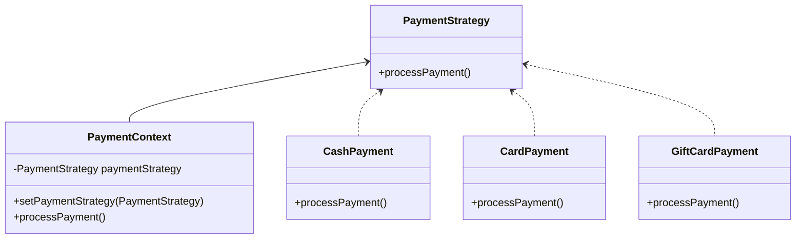

# Strategy

> A behavioral pattern

## Example: [Web store payments](../../src/main/java/strategy/payments)

The application provides three payment methods: cash, card, and gift card. The payment method can be changed at runtime.

The [`PaymentStrategy`](../../src/main/java/strategy/payments/PaymentStrategy.java) interface defines the contract for all payment strategies. The [`CashPayment`](../../src/main/java/strategy/payments/CashPayment.java), [`CardPayment`](../../src/main/java/strategy/payments/CardPayment.java), and [`GiftCardPayment`](../../src/main/java/strategy/payments/GiftCardPayment.java) classes implement the [`PaymentStrategy`](../../src/main/java/strategy/payments/PaymentStrategy.java) interface.

The [`PaymentContext`](../../src/main/java/strategy/payments/PaymentContext.java) class is the context class that uses the `PaymentStrategy` interface to perform the payment. The class
has a `setPaymentStrategy()` method to set the payment method and a `processPayment()` method to perform the payment.

The client deals with the [`PaymentContext`](../../src/main/java/strategy/payments/PaymentContext.java) class. The algorithms can be changed at runtime by setting a different payment strategy.

The following class diagram illustrates the example:

## See in the Internet

- Refactoring Guru: https://refactoring.guru/design-patterns/strategy

- SourceMaking: https://sourcemaking.com/design_patterns/strategy

