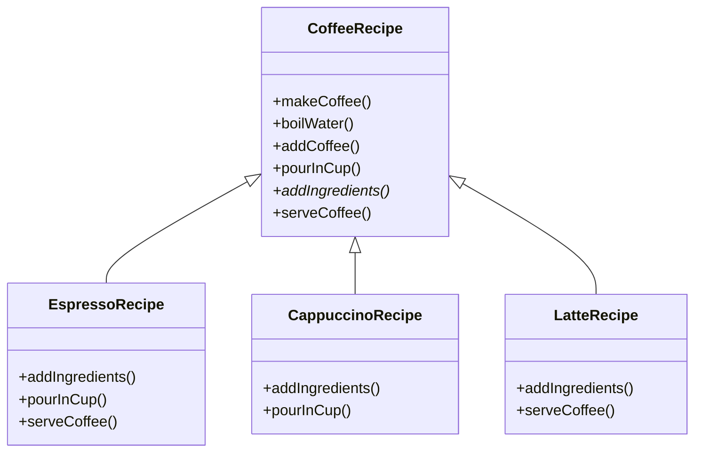

# Template method

> A behavioral pattern

## Example: [Coffee making](../../src/main/java/template_method/coffee)

In this example, the [`CoffeeRecipe`](../../src/main/java/template_method/coffee/CoffeeRecipe.java) class defines the steps to make a coffee. The steps are:

1. **Boil water:** implemented in the `boilWater()` method
2. **Add coffee to the cup**: implemented in the `addCoffee()` method
3. **Pour in cup**: implemented in the `pourInCup()` method
4. **Add ingredients**: implemented in the `addIngredients()` method
5. **Serve**: implemented in the `serveCoffee()` method

These steps are implemented in the `makeCoffee()` method, which is the template method. The template method is declared as `final` to prevent subclasses from overriding it. The template method calls the other methods in the order defined by the template method.

There are three types of coffee drinks: `Espresso`, `Cappuccino`, and `Latte`. Each of these classes extends the `CoffeeRecipe` class and override those methods that need to be customized for each type of coffee drink:

1. **Espresso**: implemented in the [`EspressoRecipe`](../../src/main/java/template_method/coffee/EspressoRecipe.java) class. The class overrides the `addIngredients()`, `pourInCup()`, and `serveCoffee()` methods.
2. **Cappuccino**: implemented in the [`CappuccinoRecipe`](../../src/main/java/template_method/coffee/CappuccinoRecipe.java) class. The class only overrides the `addIngredients()` and `pourInCup()` methods.
3. **Latte**: implemented in the [`LatteRecipe`](../../src/main/java/template_method/coffee/LatteRecipe.java) class. Like the previous class, this class overrides the `addIngredients()` and `serveCoffee()` methods.

All three coffee drinks are able to use the default implementations of the `boilWater()` and `addCoffee()` methods.

The `addIngredients()` method is declared as `abstract` in the [`CoffeeRecipe`](../../src/main/java/template_method/coffee/CoffeeRecipe.java) class. This method has to be implemented in the subclasses to add the ingredients that are specific to each type of coffee drink.

Adding a new coffee drink is straightforward. You just need to create a new class that extends the [`CoffeeRecipe`](../../src/main/java/template_method/coffee/CoffeeRecipe.java)
) class and override those methods that need to be customized for the new coffee drink.

The class diagram for this example is shown below:

## See in the Internet

- Refactoring Guru: https://refactoring.guru/design-patterns/template-method

- SourceMaking: https://sourcemaking.com/design_patterns/template_method

