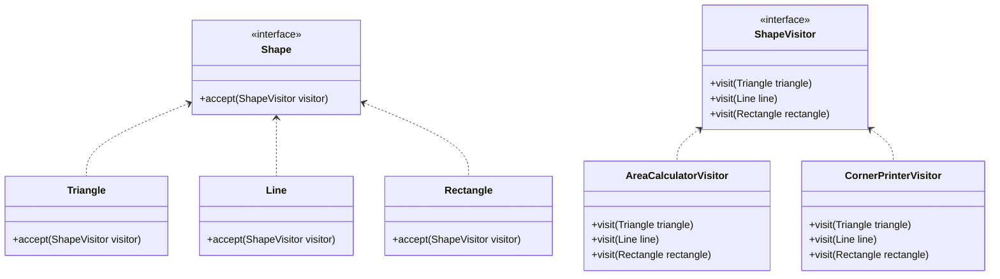

# Visitor

> A behavioral pattern

## Example: [Shapes](../../src/main/java/visitor/shapes)

In the application, classes representing three shapes are defined: [`Triangle`](../../src/main/java/visitor/shapes/Triangle.java), [`Line`](../../src/main/java/visitor/shapes/Line.java), and [`Rectangle`](../../src/main/java/visitor/shapes/Rectangle.java). Each class implements the [`Shape`](../../src/main/java/visitor/shapes/Shape.java) interface.

Note that none of the classes have methods to print the area or the corner points. The Visitor pattern is used to add these methods to the classes without modifying them.

The [`Shape`](../../src/main/java/visitor/shapes/Shape.java) interface is defined with a method `accept()` that takes a [`ShapeVisitor`](../../src/main/java/visitor/shapes/ShapeVisitor.java) as an argument. Each [`ShapeVisitor`](../../src/main/java/visitor/shapes/ShapeVisitor.java) is responsible for adding a specific functionality to the shapes.

The [`ShapeVisitor`](../../src/main/java/visitor/shapes/ShapeVisitor.java) interface declares various overloaded versions of the `visit()` method, each taking as an argument an object of one of the types: triangle, line, or rectangle.

There are two classes that implement the [`ShapeVisitor`](../../src/main/java/visitor/shapes/ShapeVisitor.java) interface: [`AreaCalculatorVisitor`](../../src/main/java/visitor/shapes/AreaCalculatorVisitor.java) and [`CornerPrinterVisitor`](../../src/main/java/visitor/shapes/CornerPrinterVisitor.java). These classes calculate the area and print the corners of each shape, respectively. These concrete classes implement the `visit()` method in a way appropriate for each type of shape available.

In the [`Main`](../../src/main/java/visitor/shapes/Main.java) class, a list with various shapes is generated. Then, the extended functionality of printing the area of each shape is achieved by using the [`AreaCalculatorVisitor`](../../src/main/java/visitor/shapes/AreaCalculatorVisitor.java) class. A visitor object is created, and the `accept` method is called on each shape, passing the visitor as an argument. As the `accept()` method is implemented for each shape, the correct overloaded version of the `visit()` method is called for each shape type.

Finally, the [`CornerPrinterVisitor`](../../src/main/java/visitor/shapes/CornerPrinterVisitor.java) class is used to print the corners of each shape in a similar way.

The following class diagram illustrates the structure of the Visitor pattern in the example:

## See in the Internet

- Refactoring Guru: https://refactoring.guru/design-patterns/visitor

- SourceMaking: https://sourcemaking.com/design_patterns/visitor

